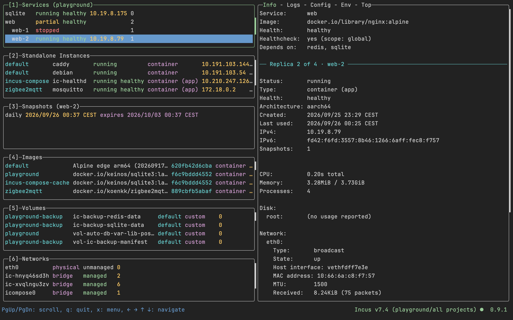

# lazyincus

> [!WARNING]
> **AI-assisted project**
> This codebase was built with [Claude Code](https://claude.com/claude-code). It works for the author's specific setup but has not been independently audited. Review the code before running it in any security-sensitive or production environment.

A terminal UI for [Incus](https://linuxcontainers.org/incus/) — a
next-generation system container, application container, and virtual
machine manager.

This is a port of [lazydocker](https://github.com/jesseduffield/lazydocker)
by [Jesse Duffield](https://github.com/jesseduffield) — the excellent Docker
TUI this project's UI, keybindings, and overall structure are lifted from.
Full credit for the original design goes to Jesse and the lazydocker
contributors. The framework underneath is [gocui](https://github.com/jroimartin/gocui)
by Roi Martin, used here through [Jesse's fork](https://github.com/jesseduffield/gocui).
See [LICENSE](LICENSE) (MIT, same as upstream),
[THIRD_PARTY_NOTICES.md](THIRD_PARTY_NOTICES.md) for third-party
attributions, and [docs/Port.md](docs/Port.md) for what was carried over and
how it was renamed.



## Status

Past the MVP it started as, and in daily use — still pre-1.0. Panels for
instances, snapshots, images, volumes, networks and — in a directory with a
compose file — services, plus the Incus concepts lazydocker has no analog
for: projects and remotes. Parity with lazydocker in the corners —
custom and bulk commands, non-English translations — isn't there; see
"What's not here yet" below, and [BACKLOG.md](BACKLOG.md) for the
panel-by-panel comparison.

## Requirements

- An [Incus](https://linuxcontainers.org/incus/) daemon (`incusd`) to talk to —
  local over its unix socket, or any remote your `incus` CLI is configured for
  (see [docs/Remotes.md](docs/Remotes.md)).
- Your user in the `incus`/`incus-admin` group (or root) for local socket
  access.
- The `incus` CLI on `PATH` — used for attaching to a console and for
  exec-into-instance.
- Go 1.27+ to build from source.
- Optional: [incus-compose](https://incus-compose.org), if you run compose
  stacks on Incus — see [Compose stacks](#compose-stacks) below. Not in
  Homebrew core; on macOS, `brew install tallica/tap/incus-compose`.

## Install / run

Every [release](https://github.com/tallica/lazyincus/releases) carries a
binary for macOS and Linux on both amd64 and arm64. Pick the archive for
yours, check it against the release's `checksums.txt`, and put the binary on
your `PATH`:

```sh
tar xzf lazyincus_*_darwin_arm64.tar.gz
sudo install lazyincus /usr/local/bin/
```

The binaries are unsigned, so macOS refuses one downloaded through a browser
until its quarantine flag is off: `xattr -d com.apple.quarantine lazyincus`.

Or build it yourself:

```sh
git clone https://github.com/tallica/lazyincus.git
cd lazyincus
go build -o lazyincus .
./lazyincus
```

or run directly without building a binary:

```sh
go run .
# or
make run
```

Flags: `-d` / `--debug` for debug logging, `--version` to print version info.

## Remotes

lazyincus talks to whichever remote the `incus` CLI treats as its default.
Point it at a different one with:

```sh
lazyincus --remote myserver
```

`INCUS_REMOTE=myserver lazyincus` does the same thing — the flag just sets
that variable, so the `incus` and `incus-compose` subprocesses follow the
panels onto the same daemon. The footer shows the remote you are on. [docs/Remotes.md](docs/Remotes.md)
covers adding a remote and its token, reaching a daemon over SSH, and the
gotchas behind running incusd in a local VM — macOS Local Network Privacy and
guest clock skew both fail in ways that point at the wrong component.

## Usage

Five side panels: **Instances** (`1`), listing both containers and VMs,
**Snapshots** (`2`) for whichever instance is selected, **Images** (`3`),
**Volumes** (`4`) and **Networks** (`5`). All list every Incus project by
default; `P` scopes them to a single project instead, and the footer shows
the current remote and scope. A project column appears on any panel whose
contents actually span projects, and actions run against the project the
item came from.

A sixth panel, **Services**, appears when there's a compose file in the
working directory — see [Compose stacks](#compose-stacks).

The instances panel's columns (name, status, health, type, IPv4, snapshot
count) can be reordered or hidden via `gui.instanceColumns` in the config
file, and the Services panel's (name, status, health, IPv4, snapshot count) via
`gui.serviceColumns` - see [docs/Config.md](docs/Config.md). Health comes
from `ic-healthd`, so it's blank for anything created outside
incus-compose.

| Key | Action |
|---|---|
| `1` … `6` | Focus a side panel, numbered top to bottom as shown in its title |
| `tab` / `shift+tab` | Next / previous side panel |
| `↑`/`↓`, `j`/`k` | Navigate |
| `PgUp`/`PgDn`, `J`/`K`, `H`/`L`, `h`/`l` | Scroll the main panel |
| `enter` | Focus main panel (Info / Logs / Config / Env / Top tabs) |
| `[` / `]` | Switch main-panel tab |
| `S` | Start; on the Services panel, start the service, or the selected replica |
| `s` | Stop; on the Services panel, stop the service, or the selected replica (confirms first) |
| `p` | Pause/unpause (toggle) |
| `d` | Delete the selected item (instances offer to stop first if running; only custom volumes and managed networks can be deleted); on the Services panel, bring the service down, or delete the selected replica |
| `u` | Services panel: bring the service up |
| `U` | Services panel: pull the latest image and recreate the service (confirms first) |
| `e` | Toggle showing stopped instances |
| `m` | Jump to Logs tab |
| `n` | New snapshot of the selected instance, from either panel — name it, `tab` to the expiry/stateful fields, `enter` or `ctrl+s` to create |
| `r` | Restart an instance, or restore a snapshot; on the Services panel, restart the service |
| `a` | Attach to the instance's console (`incus console`) |
| `E` | Exec a shell into the instance |
| `f` | Services panel: kill the service, or force stop the selected replica (confirms first) |
| `b` | Services panel: build the service |
| `g` | Services panel: pull the service's image |
| `C` | Services panel: menu of the same compose verbs run against the whole stack rather than the selected service ([Compose stacks](#compose-stacks)) |
| `y` | Copy the instance's IPv4 address to the clipboard |
| `P` | Switch Incus project (re-scopes the instance list) |
| `o` | Open the lazyincus config file |
| `O` | Edit the lazyincus config file in `$VISUAL`/`$EDITOR` |
| `+` / `_` | Next / previous screen mode |
| `/` | Filter |
| `x` / `?` | Keybinding menu |
| `q` | Quit |

Config file: `~/.config/lazyincus/config.yml`. See [docs/Config.md](docs/Config.md)
for the full list of options and defaults.

## Compose stacks

[incus-compose](https://incus-compose.org) runs an unmodified
`compose.yaml` against Incus, giving each compose project an Incus project
of its own. lazyincus reads those stacks two ways.

**Anywhere, from the daemon.** The `service`, `health` and `image` columns
read the config keys incus-compose stamps on each instance, so a stack
shows up in the instances panel from another machine entirely, with no
compose file and no `incus-compose` binary in sight. `health` is on by
default; the other two you add through `gui.instanceColumns` — see
[docs/Config.md](docs/Config.md).

**As a panel, from the compose file.** Start lazyincus from a directory
holding a compose file and a **Services** panel appears above the others as
`1`, titled with the compose project, with every other panel shifting down
a number. It needs the `incus-compose` binary on `PATH`. To run from
somewhere else, name the directory:

```sh
lazyincus --project-directory ~/stacks/zigbee2mqtt
```

`-P` is the short form, and `INCUS_COMPOSE_PROJECT_DIRECTORY` in the
environment does the same — the flag sets that variable, so incus-compose
resolves the stack exactly as it would on its own command line.

The rows come from the compose file rather than the daemon, so a service
the file declares but nothing is running still gets one, in state `none`.
Otherwise a service carries the status of the instances under it —
`running`, `frozen`, whatever they are, or `partial` when replicas
disagree. The stack's own instances move out of the instances panel, which
becomes **Standalone Instances** (`2`); every other project's instances
stay there.

A service with replicas lists them under it, one indented row each,
rendered in the same columns as the service. Selecting a replica points
everything that needs a single instance at it. The service's own row above
them means all of its replicas, which is what selecting the service has
always meant.

What the keys run on a service's own row, each of them `incus-compose
<verb> <service>`:

- `u` — `up --detach`; `U` adds `--pull always --recreate`, to pick up an
  image the compose file's tag now resolves to (it confirms first)
- `S`, `s`, `r` — `start`, `stop`, `restart`; `s` confirms
- `d` — `down`, plain or `--volumes`, after a confirmation
- `p` — `pause`, or `unpause` when the service is already frozen
- `f`, `b`, `g` — `kill`, `build`, `pull`; `f` confirms

- `C` — the same verbs with the service argument left off, so they act on
  the whole stack, plus `logs --follow`. It needs no selection, which is
  how a project whose services have never been deployed gets brought up
- `m`, `n`, `E` and `y` act on the service's instance rather than on
  compose: the selected replica's, or the only one there is, and they ask
  which from a service's own row. There's no `a`: a compose service runs an
  OCI image, which has no console to attach to

On a **replica's** row, the keys that can mean one instance do: `S`, `s`,
`r` and `p` start, stop, restart and freeze that replica, `d` deletes it —
incus-compose creates it again on the next `u`, the compose file still
asking for it — and `f` force stops it. They're the instances panel's own
keys, a replica being an instance. `u`, `U`, `b`, `g` and `C` have no
per-replica form and keep acting on the service. `x` says which you'll get:
it reads the row under the cursor.

Selecting a service points the snapshots panel at its instance, the way
selecting an instance does — a replica's row at its own, a service's row
with replicas under it at none.

The main panel tabs are the instance's with the service's own on top:
**Info** shows what the compose file declares — image, command, restart
policy, ports, volumes, devices, depends-on — and then the instance's own
Info; **Config** shows the service's slice of `incus-compose config` and
then the daemon's dump. From a service's row those cover every replica;
from a replica's row, that replica alone. **Logs**, **Env** and **Top**
need one instance, so a service's row with replicas under it points at
them instead.

Two gotchas that aren't ours, both on `U`. It fails on a stack with a bind
mount or device passthrough whenever the daemon isn't on the same host,
because `--recreate` re-validates those sources. And a `--recreate` that
fails anywhere is rolled back by incus-compose deleting what it just
created, so the stack ends up empty rather than back where it started —
the error on screen is then the rollback's, not the cause. Re-run the
command outside lazyincus with `--debug` to see that. Plain `u` doesn't
re-create an existing instance, so it hits neither.

## Supporting upstream

lazyincus is a thin layer over other people's work — Incus does everything
that matters here, incus-compose does the same for the Services panel, and
lazydocker is what it was ported from. None of them asks anything of you
for that, but some of the people behind them take sponsorships:

- [Stéphane Graber](https://github.com/sponsors/stgraber) — project leader
  of [Linux Containers](https://linuxcontainers.org/), the umbrella over
  Incus, IncusOS, LXC and more.
- [Jesse Duffield](https://github.com/sponsors/jesseduffield) — author of
  lazydocker, lazygit and more.

Special thanks also go to [René Jochum](https://github.com/jochumdev),
author of [incus-compose](https://github.com/lxc/incus-compose) and the
hand behind nearly every commit in it. There's no sponsorship page to
point at, so starring incus-compose is the way to give that work some
visibility.

If lazyincus is useful to you, the money is better spent upstream than
here. A star on this repo, though, is always welcome.

## What's not here yet

Not full parity with lazydocker. Not included:

- The credits and aggregate-log tabs lazydocker's Services/Project panel
  had — the panel itself and the compose verbs are covered by the Services
  panel above; see
  [BACKLOG.md](BACKLOG.md#incus-compose-integration) for what's left
- Custom and bulk commands
- Historical resource-usage graphing (the Info tab's stats are point-in-time only)
- Non-English translations
- Windows support

VM instances are listed and can be started/stopped/deleted like containers,
but freeze/unfreeze and exec are untested against a real VM — see
[BACKLOG.md](BACKLOG.md#blocked) for why and what's needed to verify them.

See [CLAUDE.md](CLAUDE.md) for the architecture and the Incus API
integration details.

## Changelog

See [CHANGELOG.md](CHANGELOG.md). Unscheduled ideas and follow-up work are in [BACKLOG.md](BACKLOG.md).

## Contributing

Standard Go project layout, no vendor directory. Build/test with:

```sh
go build ./...
go vet ./...
go test ./...
```

or via the Makefile (`make build`, `make vet`, `make test`, `make lint`,
`make run`, `make clean`).

## License

MIT — see [LICENSE](LICENSE). This project carries forward the original
lazydocker copyright notice as required by its MIT license, since much of
the code here is ported/adapted from it. Third-party dependency licenses
(gocui, the Incus client library, etc.) are listed in
[THIRD_PARTY_NOTICES.md](THIRD_PARTY_NOTICES.md).
