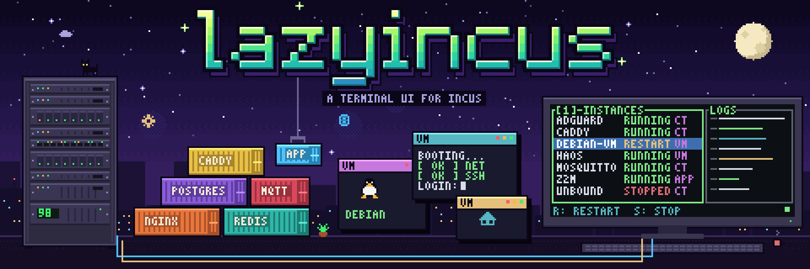
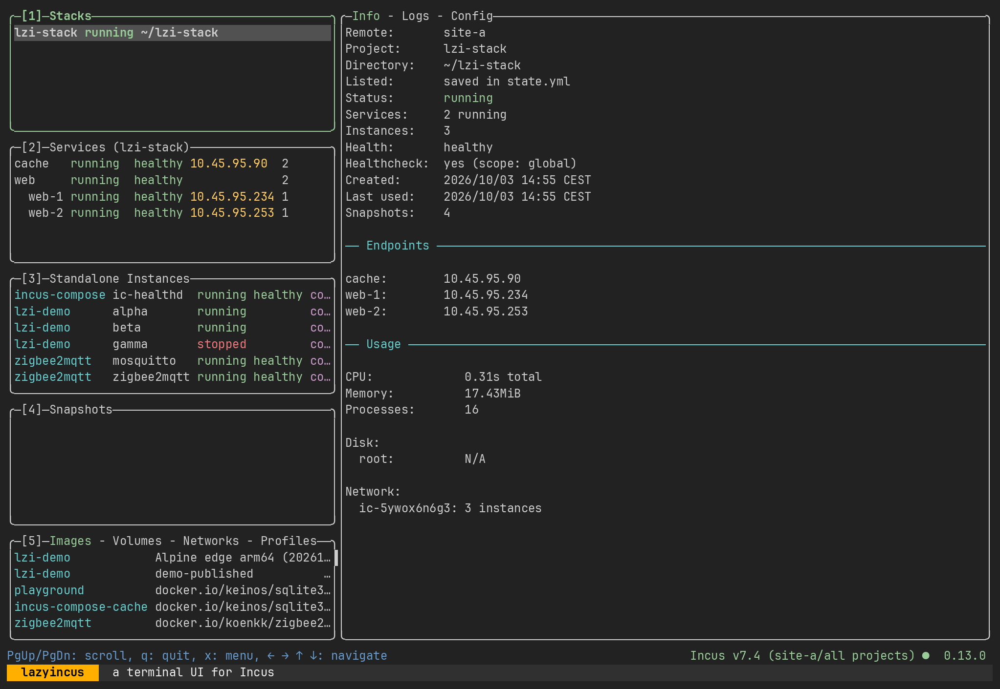

# lazyincus

lazyincus is a terminal UI (TUI) for
[Incus](https://linuxcontainers.org/incus/) — a next-generation system
container, application container, and virtual machine manager. One
keyboard-driven screen shows every instance and its state, and runs the
commands you'd otherwise type at the `incus` CLI.

This is a port of [lazydocker](https://github.com/jesseduffield/lazydocker)
by [Jesse Duffield](https://github.com/jesseduffield) — the excellent Docker
TUI this project's UI, keybindings, and overall structure are lifted from.
Full credit for the original design goes to Jesse and the lazydocker
contributors. The framework underneath is [gocui](https://github.com/jroimartin/gocui)
by Roi Martin, used here through [Jesse's fork](https://github.com/jesseduffield/gocui).
See [LICENSE](LICENSE) (MIT, same as upstream),
[THIRD_PARTY_NOTICES.md](THIRD_PARTY_NOTICES.md) for third-party
attributions, and [docs/Port.md](docs/Port.md) for what was carried over and
how it was renamed.

[](https://asciinema.org/a/1267372)

[Watch every key in action](https://asciinema.org/a/1267372) — a
six-minute walkthrough on asciinema.org.

## Status

Past the MVP it started as, and in daily use — still pre-1.0. Panels for
instances, snapshots, images, volumes, networks, profiles and — with
incus-compose installed — compose stacks and their services, plus the Incus concepts
lazydocker has no analog for: projects and remotes. Parity with lazydocker
in the corners — custom and bulk commands, non-English translations —
isn't there; see "What's not here yet" below, and
[BACKLOG.md](BACKLOG.md) for the panel-by-panel comparison.

> [!WARNING]
> **AI-assisted project**<br>
> This codebase was built with [Claude Code](https://claude.com/claude-code). It works for the author's specific setup but has not been independently audited. Review the code before running it in any security-sensitive or production environment.

## Requirements

- An [Incus](https://linuxcontainers.org/incus/) daemon (`incusd`) to talk to —
  local over its unix socket, or any remote your `incus` CLI is configured for
  (see [docs/Remotes.md](docs/Remotes.md)).
- Your user in the `incus`/`incus-admin` group (or root) for local socket
  access.
- The `incus` CLI on `PATH` — used for attaching to a console, a shell in
  an instance, editing an item's config or a file inside an instance in
  your editor, and making a new instance from a snapshot.
- Go 1.27+ to build from source.
- Optional: [incus-compose](https://incus-compose.org), if you run compose
  stacks on Incus — see [Compose stacks](#compose-stacks) below. Not in
  Homebrew core; on macOS, `brew install tallica/tap/incus-compose`.

## Install / run

On macOS, [Homebrew](https://brew.sh) installs the release binary from
[tallica/tap](https://github.com/tallica/homebrew-tap):

```sh
brew install tallica/tap/lazyincus
```

Or take the binary straight from a
[release](https://github.com/tallica/lazyincus/releases) — there's one for
macOS and Linux on both amd64 and arm64. Check the archive against the
release's `checksums.txt`, then put the binary on your `PATH`:

```sh
tar xzf lazyincus_*_darwin_arm64.tar.gz
sudo install lazyincus /usr/local/bin/
```

The binaries are unsigned, so macOS refuses one downloaded through a browser
until its quarantine flag is off: `xattr -d com.apple.quarantine lazyincus`.

Or build it yourself, with `brew install --HEAD tallica/tap/lazyincus` or
from a checkout:

```sh
git clone https://github.com/tallica/lazyincus.git
cd lazyincus
go build -o lazyincus .
./lazyincus
```

or run directly without building a binary:

```sh
go run .
# or
make run
```

Flags: `-r` / `--remote` picks the remote ([Remotes](#remotes)),
`-P` / `--project-directory` which compose stack to list first
([Compose stacks](#compose-stacks)), `--read-only` to change nothing
anywhere, `-d` / `--debug` for debug logging to `development.log` in the
config directory (`LOG_LEVEL=trace` adds the noisiest lines, `info` or
`warn` trims it), `--log-format json` to write it as JSON rather than plain
lines, `--version` to print version info.

Tip: it's a lot of letters for something you open all day. An alias in
your `~/.zshrc` or `~/.bashrc` shortens it:

```sh
alias lzi="lazyincus"
```

## Remotes

lazyincus talks to whichever remote the `incus` CLI treats as its default.
Point it at a different one with:

```sh
lazyincus --remote myserver
```

`INCUS_REMOTE=myserver lazyincus` does the same thing — the flag just sets
that variable, so the `incus` and `incus-compose` subprocesses follow the
panels onto the same daemon. The footer shows the remote you are on, and
`R` switches to another while running. A compose stack can live on a
remote of its own — see [Compose stacks](#compose-stacks). A remote you
only want to look at can be made [read-only](docs/Config.md#top-level) in
the config, and any remote given a colour ([demo](https://asciinema.org/a/1268023)).
[docs/Remotes.md](docs/Remotes.md) covers adding a remote and its token,
reaching a daemon over SSH, and the gotchas behind running incusd in a
local VM — macOS Local Network Privacy and guest clock skew both fail in
ways that point at the wrong component.

## Usage

Three side panels: **Instances** (`1`), listing both containers and VMs,
**Snapshots** (`2`) for whichever instance or custom volume is selected,
or every instance's, and **Resources** (`3`), which holds **Images**,
**Volumes**, **Networks** and **Profiles** as tabs — `←`/`→` or `h`/`l`
reach each of them in turn, as does pressing `3` again or clicking a tab's
name. All list every Incus project by default; `P` scopes them to a single
project instead, `R` moves them to another remote
([docs/Remotes.md](docs/Remotes.md)), and the footer shows the current
remote and scope, how many operations are running or have failed since you
last looked at them, and how many of the daemon's warnings no one has
acknowledged — `W` lists both, the operations to cancel (`d`), the
warnings to acknowledge (`a`) or delete (`d`). A project column appears on
any panel whose contents actually span projects, and actions run against
the project the item came from. Every Info tab, and the top of every
Config tab, says where the item lives: its remote, its project, and for a
compose instance its stack and service.

With [incus-compose](#compose-stacks) installed, two more panels come
first: **Stacks** (`1`) and the selected stack's **Services** (`2`), the
others shifting down two numbers, and on a remote with a stack listed,
Snapshots gains a **Backups** tab: the selected stack's `incus-compose
backup` runs.

The instances panel's columns (name, status, health, type, IPv4, snapshot
count) can be reordered or hidden via `gui.instanceColumns` in the config
file, and the Services panel's (name, status, health, IPv4, snapshot count) via
`gui.serviceColumns` - see [docs/Config.md](docs/Config.md). Health comes
from `ic-healthd`, so it's blank for anything created outside
incus-compose, and for an instance that isn't running: ic-healthd takes
seconds to catch up with a pause or stop, and never does while it's down.

| Key | Action |
|---|---|
| `1` … `5` | Focus a side panel, numbered top to bottom as shown in its title; again on Resources or Snapshots, its next tab |
| `tab` / `shift+tab` | Next / previous side panel |
| `←`/`→`, `h`/`l` | Previous / next list, Images, Volumes, Networks and Profiles each a stop of their own |
| `↑`/`↓`, `j`/`k` | Navigate |
| `PgUp`/`PgDn`, `ctrl+u`/`ctrl+d`, `J`/`K`, `H`/`L` | Scroll the main panel (and `h`/`l`, `←`/`→` sideways while it has focus) |
| `Home` / `End` | Main panel: jump to the top / follow the end again |
| `enter` | Focus main panel (Info / Logs / Config / Env / Top tabs) |
| `space` | Stacks panel: switch to the stack's remote |
| `[` / `]` | Switch main-panel tab |
| `S` | Start; on the Services panel, start the service, or the selected replica |
| `s` | Stop; on the Services panel, stop the service, or the selected replica (confirms first) |
| `p` | Pause/resume (toggle) |
| `d` | Delete the selected item (instances offer to stop first if running; only custom volumes and managed networks can be deleted, and a profile nothing uses); on the Services panel, bring the service down, or delete the selected replica; on the Backups tab, delete the backup |
| `c` | Edit the selected item's config in `$EDITOR`, through `incus config edit` for an instance (on the Services panel, the replica's, asking which from a service's own row) and `incus ... edit` for an image, volume, network or profile; on the Stacks panel, the stack's compose file |
| `D` | Images tab: prune the images no instance was created from, or only the cached ones (confirms first, naming each); on the Backups tab, delete all but the newest N backups; on the Stacks panel, remove the stack from the list |
| `u` | Services panel: bring the service up; on Images, Volumes, Networks and Profiles, list the instances using it (`esc` brings back the rest and returns to where you were) |
| `U` | Services panel: pull the latest image and recreate the service (confirms first) |
| `C` | Instances panel: show / hide the stacks' instances alongside the standalone ones |
| `e` | Show / hide what a list leaves out: stopped instances, on the Networks tab the host's unmanaged interfaces, and on the Snapshots panel every instance's snapshots rather than the selected one's; on the Stacks panel, edit the stack's remote and directory |
| `m` | Jump to Logs tab |
| `M` | Stacks and Services panels: follow the stack's or service's logs, every instance's interleaved (`incus-compose logs --follow`) |
| `n` | New snapshot of the selected instance, from either panel, or of the selected custom volume — name it, `tab` to the expiry/stateful fields, `enter` or `ctrl+s` to create; on the Backups tab, back up the stack, stopping it for the backup or `--live` |
| `r` | Restart an instance, or restore a snapshot; on the Services panel, restart the service; on the Backups tab, restore the stack's volumes, or one service's, from the backup (incus-compose asks first) |
| `v` | Backups tab: verify the backup's restore points are all there |
| `B` | Stacks and Services panels: go to the stack's Backups tab, switching to the stack's remote first if it's elsewhere, as `space` does |
| `a` | Attach to the instance's console (`incus console`); on the Stacks panel, add a stack |
| `E` | Exec a shell into the instance |
| `F` | Edit a file inside the instance in `$EDITOR`, through `incus file edit`, asking for its path (on the Services panel, the replica's) |
| `f` | Services panel: kill the service, or force stop the selected replica (confirms first) |
| `b` | Services panel: build the service |
| `g` | Services panel: pull the service's image |
| `u` `U` `S` `s` `r` `p` `d` `f` `b` `g` `M` | Stacks panel: the Services panel's compose verbs, run against the whole stack |
| `y` | Copy to the clipboard, from a menu of what the item has: an instance's name and addresses, an image's fingerprint or alias, a network's name or addresses, a snapshot as `owner/snapshot`, a stack's project, directory or a published port's address, and so on |
| `P` | Switch Incus project (re-scopes the instance list) |
| `R` | Switch Incus remote, for this session |
| `W` | The remote's operations and warnings, `[`/`]` switching between them: `d` cancels an operation; `a` acknowledges or resets a warning, `d` deletes it; `enter` shows the rest ([demo](https://asciinema.org/a/1268025)) |
| `o` | Open the lazyincus config file |
| `O` | Edit the lazyincus config file in `$VISUAL`/`$EDITOR` |
| `+` / `_` | Next / previous screen mode |
| `=` | Expand / collapse the focused side panel |
| `/` | Filter; in the main panel, search it: `n` / `N` step through the matches, `esc` clears them |
| `x` / `?` | Keybinding menu |
| `ctrl+p` | Command palette: every panel's actions, filtered as you type, each with the item it acts on; one on another panel focuses it first. Typing also lists every item the panels list: `enter` goes to it, `tab` lists its actions ([demo](https://asciinema.org/a/1268020)) |
| `q`, `ctrl+c` | Quit |

With no key of their own, in the command palette and the keybinding menu:

| Action | What it does |
|---|---|
| rename | Instances panel: rename an instance; a running one is stopped first and started again, once confirmed |
| rename | Snapshots panel: rename the snapshot, an instance's or a custom volume's |
| new instance from snapshot | Snapshots panel: copy an instance's snapshot into a new instance in the same project (`incus copy`), named in a prompt, and focus it; not a compose instance's, whose copy would join its service |
| edit description | Instances and Services panels: edit the instance's description in a one-line prompt; saving it empty clears it |

Config file: `config.yml` in `~/.config/lazyincus` (on macOS,
`~/Library/Application Support/lazyincus` unless the former exists). See
[docs/Config.md](docs/Config.md) for the full list of options and defaults.

## Compose stacks

[incus-compose](https://incus-compose.org) runs an unmodified
`compose.yaml` against Incus, giving each compose project an Incus project
of its own. lazyincus reads those stacks two ways.

**Anywhere, from the daemon.** The `service`, `health` and `image` columns
read the config keys incus-compose stamps on each instance, so a stack
shows up in the instances panel from another machine entirely, with no
compose file and no `incus-compose` binary in sight. `health` is on by
default; the other two you add through `gui.instanceColumns` — see
[docs/Config.md](docs/Config.md).

**As panels, from the compose files.** With the `incus-compose` binary on
`PATH`, a **Stacks** panel comes first, as `1`, listing compose stacks —
directories with a compose file in them — and a **Services** panel under
it, as `2`, shows the services of whichever stack is selected, titled with
its compose project. Every other panel shifts down two numbers.

The directory lazyincus starts in is a stack when it holds a compose file,
listed first. To start with another, name it:

```sh
lazyincus --project-directory ~/stacks/zigbee2mqtt
```

`-P` is the short form, and `INCUS_COMPOSE_PROJECT_DIRECTORY` in the
environment does the same. Any other stack you add with `a` on the Stacks
panel: type its directory — `~` and relative paths work — and it's listed
from then on, in every session, saved in `state.yml` beside the config
file ([docs/Config.md](docs/Config.md#state)). `e` changes a stack's
remote or directory in place, and `D` takes a stack you added off the list
again, after asking; nothing in it is stopped or deleted. `c` opens its
compose file in your editor.

A stack you add belongs to a remote: the one lazyincus is showing, or
another you put in front of the directory, the way `incus` names things —
`pve01:~/deployments/pve01/caddy`. Its row, services, tabs and every verb
go to that remote whichever one a later session is on, so one list can
hold the stacks of several servers. When one does, the Stacks panel grows
a remote column with the active remote marked `*`, and `space` on a stack
moves the rest of the screen — instances, snapshots, resources, the
footer — to that stack's remote, the way `R` does. While a stack isn't on
the active remote, its Services and Snapshots titles and every
confirmation for it name its remote. The compose files stay on this
machine, so the "not on the same host" gotcha at the end of this section
applies. On a remote with none of the listed stacks, Stacks and Services
shrink to their titles and the focus starts on Instances; focusing either
swaps them with Instances, and `gui.collapseStacksElsewhere`
([docs/Config.md](docs/Config.md#gui)) turns it off.

A stack's row says how its instances are doing, as one status: theirs when
they agree, `partial` when they don't, `none` when nothing is deployed,
`error` when its compose file can't be read, `connecting` while its remote
is first reached, and `unreachable` when that remote doesn't answer or is
no longer in the incus CLI's config. The Info tab says why, and for a
renamed remote `e` fixes the stack. Its keys are the Services panel's
compose verbs below, run against the whole stack. The Info tab says where
the stack can be reached, what it's using, and where the daemon has drifted
from the compose file; the Logs tab stacks every service's logs, and the
Config tab is the whole of `incus-compose config`.

The Services rows come from the compose file rather than the daemon, so a
service the file declares but nothing is running still gets one, in state
`none`. Otherwise a service carries the status of the instances under it —
`running`, `frozen`, whatever they are, or `partial` when replicas
disagree. The service instances of every listed stack on the active
remote move out of the instances panel, which becomes **Standalone
Instances** (`3`); a project no stack lists keeps its instances there, as
does an instance of a service the compose file no longer declares. `C`
there puts the stacks' instances back for a while, in one list with
everything else.

A service with replicas lists them under it, one indented row each,
rendered in the same columns as the service. Selecting a replica points
everything that needs a single instance at it. The service's own row above
them means all of its replicas, which is what selecting the service has
always meant.

What the keys run on a service's own row, each of them `incus-compose
<verb> <service>`:

- `u` — `up --detach`; `U` adds `--pull always --recreate`, to pick up an
  image the compose file's tag now resolves to (it confirms first)
- `S`, `s`, `r` — `start`, `stop`, `restart`; `s` confirms. When a
  service it depends on is stopped, `S` asks whether to start it along with
  them (`start --with-deps`) or alone — incus-compose's `start` leaves
  dependencies alone unless asked
- `d` — `down`, plain or `--volumes`, after a confirmation
- `p` — `pause`, or `unpause` when the service is already frozen
- `f`, `b`, `g` — `kill`, `build`, `pull`; `f` confirms
- `M` — `logs --follow`, every replica's interleaved, until `ctrl+c`. It
  starts empty: a container's console log is handed out once, and the Logs
  tabs have read what's there, so it shows what's written from then on

- `m`, `n`, `E` and `y` act on the service's instance rather than on
  compose: the selected replica's, or the only one there is, and they ask
  which from a service's own row. There's no `a`: a compose service runs an
  OCI image, which has no console to attach to

On a **replica's** row, the keys that can mean one instance do: `S`, `s`,
`r` and `p` start, stop, restart and freeze that replica, `d` deletes it —
incus-compose creates it again on the next `u`, the compose file still
asking for it — and `f` force stops it. They're the instances panel's own
keys, a replica being an instance. `u`, `U`, `b`, `g` and `M` have no
per-replica form and keep acting on the service. `x` says which you'll get:
it reads the row under the cursor.

Selecting a service points the snapshots panel at its instance, the way
selecting an instance does — a replica's row at its own, a service's row
with replicas under it at none.

The main panel tabs are the instance's with the service's own on top:
**Info** shows what the compose file declares — image, command, restart
policy, ports, volumes, devices, depends-on — and then the instance's own
Info; **Config** shows the service's slice of `incus-compose config` and
then the daemon's dump. From a service's row those cover every replica;
from a replica's row, that replica alone. **Logs**, **Env** and **Top**
need one instance, so a service's row with replicas under it points at
them instead.

The **Backups** tab, beside Snapshots, lists the selected stack's
`incus-compose backup` runs, newest first. `n` takes one, named or not,
asking whether to stop the stack for it — incus-compose's default, which
it starts again after — or take it `--live`. `r` restores every volume, or
one service's, `d` deletes a backup, `D` keeps only the newest N, and `v`
checks its restore points are all there. A restore asks for itself and
refuses while the services are running, so stop the stack first. See
[docs/Panels.md](docs/Panels.md#backups).

Two gotchas that aren't ours. On a stack with a bind mount or device
passthrough, `U` and `n` on the Backups tab fail whenever the daemon isn't
on the same host — `failed to add a bind-mount for service <name>: not on
the same host` — because both have incus-compose resolve those sources,
which it refuses to do from another machine. And a `U` that fails
anywhere is rolled back by incus-compose deleting what it just created,
so the stack ends up empty rather than back where it started — the error
on screen is then the rollback's, not the cause. Re-run the command
outside lazyincus with `--debug` to see that. Plain `u` doesn't re-create
an existing instance, so it hits neither.

## Supporting upstream

lazyincus is a thin layer over other people's work — Incus does everything
that matters here, incus-compose does the same for the Services panel, and
lazydocker is what it was ported from. None of them asks anything of you
for that, but some of the people behind them take sponsorships:

- [Stéphane Graber](https://github.com/sponsors/stgraber) — project leader
  of [Linux Containers](https://linuxcontainers.org/), the umbrella over
  Incus, IncusOS, LXC and more.
- [Jesse Duffield](https://github.com/sponsors/jesseduffield) — author of
  lazydocker, lazygit and more.

Special thanks also go to [René Jochum](https://github.com/jochumdev),
author of [incus-compose](https://github.com/lxc/incus-compose) and the
hand behind nearly every commit in it. There's no sponsorship page to
point at, so starring incus-compose is the way to give that work some
visibility.

If lazyincus is useful to you, the money is better spent upstream than
here. A star on this repo, though, is always welcome.

## What's not here yet

Not full parity with lazydocker. Not included:

- The credits tab lazydocker's Project panel had, and its logs tab
  interleaving every container's — the panel itself and the compose verbs
  are covered by the Services panel above; see
  [BACKLOG.md](BACKLOG.md#incus-compose-integration) for what's left
- Custom and bulk commands
- Historical resource-usage graphing (the Info tab's stats are
  point-in-time only)
- Non-English translations
- Windows support

See [CLAUDE.md](CLAUDE.md) for the architecture and the Incus API
integration details.

## Changelog

See [CHANGELOG.md](CHANGELOG.md). Unscheduled ideas and follow-up work are in [BACKLOG.md](BACKLOG.md).

## Contributing

Standard Go project layout, no vendor directory. Build/test with:

```sh
go build ./...
go vet ./...
go test ./...
```

or via the Makefile (`make build`, `make vet`, `make test`, `make lint`,
`make run`, `make clean`).

## License

MIT — see [LICENSE](LICENSE). This project carries forward the original
lazydocker copyright notice as required by its MIT license, since much of
the code here is ported/adapted from it. Third-party dependency licenses
(gocui, the Incus client library, etc.) are listed in
[THIRD_PARTY_NOTICES.md](THIRD_PARTY_NOTICES.md).
